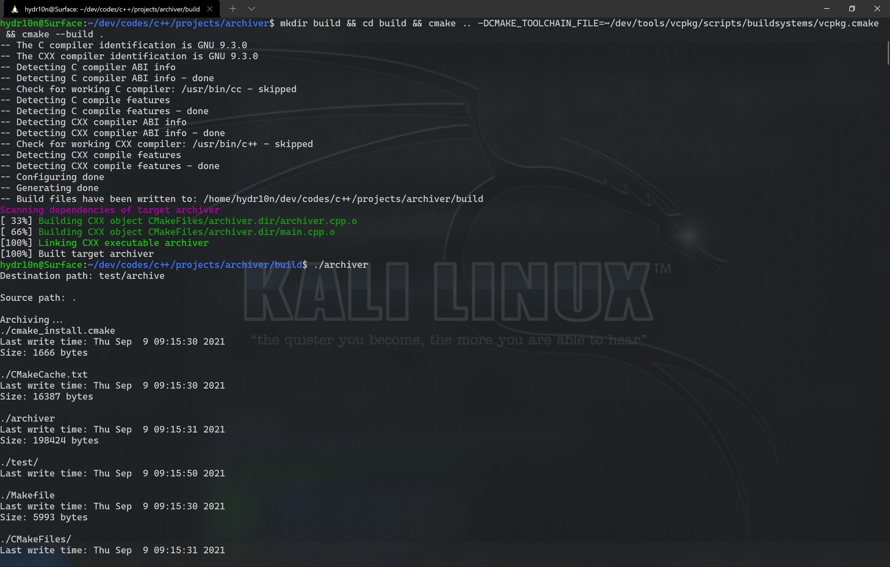
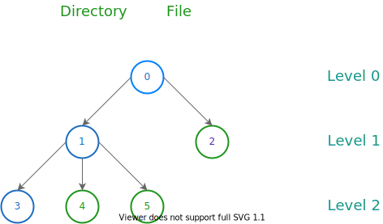
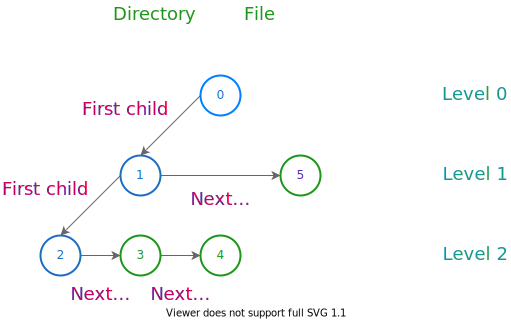

# archiver

A proof-of-concept project using modern C++ to implement a simple system to collect multiple data files together into a single file.

**archiver** can:
- Store basic information of directories and files (name, size, last write time) into a single file
- List contents in such a file

Endianness is not taken into account.



## How It Works
Let's take a look at the following picture first:



Each directory/file represents a node, and each node points to sibling or child nodes. We can traverse such a tree in pre-order, and link them using a data structure like the following to store nodes:

```CPP
struct file_node {
    bool is_dir;
    uint64_t next_sibling_offset, first_child_offset;
};
```

Then, the tree should look like this:



Storing data is easy; loading data correctly is, however, not. To ensure data integrity, xxHash library is used to hash all data, and the 64-bit result is stored in the file header. After an archive has been verified, **archiver** tries to locate internal ```file_node```s using the following algorithm, which implements an abstract layer ```find_file```/```find_next``` similar to OS File API (e.g., ```opendir```/```readdir```, ```FindFirstFile```/```FindNextFile```) :
1. Split the path to search for into a file name list, each file name represents an increasing level
2. Loop to try to locate the first node whose file name is case-sensitively matched among the sibling nodes in each level. If all located, then report the absolute position of the highest-level node in the file, which can be used to retrieve other data later, and, if the path ends with a slash, then try to locate its first child node

## Build

Dependencies (can be acquired using [vcpkg](https://github.com/microsoft/vcpkg)) :
- [xxHash](https://github.com/Cyan4973/xxHash)

```sh
$ mkdir build
$ cd build
$ cmake .. -DCMAKE_TOOLCHAIN_FILE=[path to vcpkg]/scripts/buildsystems/vcpkg.cmake
$ cmake --build .
```
